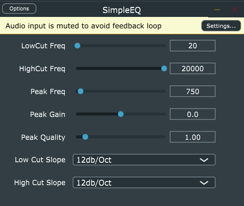

## Adding Parameters Layout

Go to PluginProcessor.h and add: 

```c++

juce::AudioProcessorValueTreeState::ParameterLayout createParameterLayout(); //creates the parameters declaration
juce::AudioProcessorValueTreeState apvts{*this, nullptr, "Parameters", createParameterLayout()}; //use the parameters

```

Now go to PluginProcessor.cpp and add:

```c++

juce::AudioProcessorValueTreeState::ParameterLayout SimpleEQAudioProcessor::createParameterLayout() //creates the parameters definition
{
    juce::AudioProcessorValueTreeState::ParameterLayout layout; //create a variable called layout of type ParameterLayout
    
    //adds the low cut filter parameters to layout (parameterID, parameterLabel, range(min, max, step, deviation), default)

    layout.add(std::make_unique<juce::AudioParameterFloat>("LowCut Freq", //id
                                                           "LowCut Freq", //label  
                                                           juce::NormalisableRange<float>(20.f, 20000.f, 1.f, 1.f),//range
                                                           20.f));//default

    return layout;


};

```
On the GUI with all parameters it would look like:



